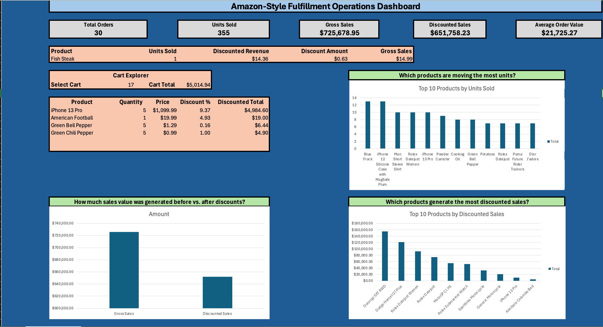
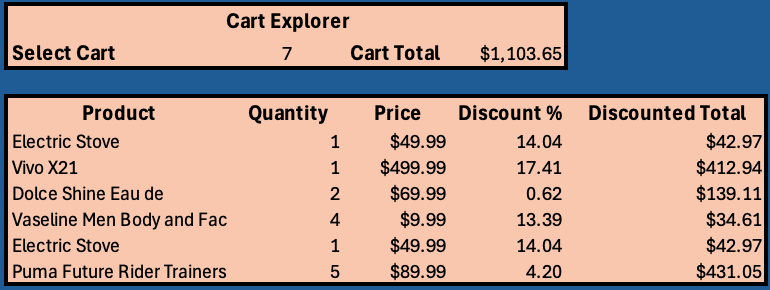

# Amazon-Style Fulfillment Operations Dashboard

## Project Overview

This project is an Excel-based fulfillment operations dashboard built using publicly available simulated e-commerce data.

The goal was to practice turning raw API data into a usable analytics dashboard that could help identify sales trends, product performance, order activity, and the impact of discounts.

This project was created as part of my development toward a career in data analytics, with a focus on building practical, hands-on experience with Excel, data cleaning, automation, and data visualization.

> **Note:** This project does not use confidential or proprietary Amazon data. The data comes from the public DummyJSON API and is used to simulate an e-commerce/fulfillment environment.

## Tools & Technologies

* Microsoft Excel
* VBA
* REST API
* DummyJSON API
* PivotTables
* Excel formulas
* Data cleaning and transformation
* Data visualization
* Interactive Excel dashboard

## Data Pipeline

The project follows this general workflow:

**API → VBA → Raw Data → Clean Data → Calculations → PivotTables → Dashboard**

VBA was used to retrieve data from the public API and transform nested order/product information into a structured format that could be analyzed in Excel.

## Dashboard

### Main Dashboard

The dashboard provides an overview of fulfillment and sales activity, including:

* Total Orders
* Units Sold
* Gross Sales
* Discounted Sales
* Average Order Value
* Top products by discounted sales
* Top products by units sold
* Gross Sales vs. Discounted Sales

### Product Explorer

The Product Explorer allows the user to select an individual product and view:

* Units Sold
* Gross Sales
* Discounted Revenue
* Discount Amount

### Cart Explorer

The Cart Explorer allows the user to select an individual cart and dynamically view the products included in that order, along with quantities, prices, discounts, and the total discounted value.

## Key Findings

A few observations from the dataset include:

* The highest-selling product by unit volume was not the same product that generated the highest discounted sales.
* **Durango SXT RWD** generated approximately **$154,585.96** in discounted sales from 5 units.
* **iPhone 12 Silicone Case with MagSafe Plum** sold 13 units but generated approximately **$335.80** in discounted sales.
* Gross sales were approximately **$725,678.95**, compared with approximately **$651,758.23** in discounted sales.
* The difference between gross and discounted sales was approximately **$73,920.72**, representing the effect of discounts in the dataset.

These comparisons demonstrate why both unit volume and revenue should be considered when evaluating product performance.

## What I Practiced

Through this project, I practiced:

* Working with API data
* Using VBA to automate data retrieval
* Parsing JSON data
* Transforming nested data into an analysis-ready table
* Creating calculated fields
* Using Excel formulas such as `SUM`, `SUMIF`, and `COUNTA`
* Building PivotTables
* Creating charts and visualizations
* Designing KPI metrics
* Building interactive dashboard selectors
* Using dynamic Excel formulas such as `FILTER` and `CHOOSECOLS`
* Communicating analytical findings visually

## Files

* `Amazon_Operations_Dashboard.xlsm` — Interactive Excel dashboard and VBA project
* `dashboard.png` — Main dashboard screenshot
* `product-explorer.png` — Product Explorer screenshot
* `cart-explorer.png` — Cart Explorer screenshot

## Data Source

Data was retrieved from the publicly available DummyJSON API.

The dataset is simulated and is used strictly for educational and portfolio purposes.

## Future Improvements

Potential future improvements include:

* Adding additional operational metrics
* Expanding the dataset
* Adding category-level analysis
* Adding additional time-based analysis
* Improving dashboard filtering options
* Connecting additional public datasets
